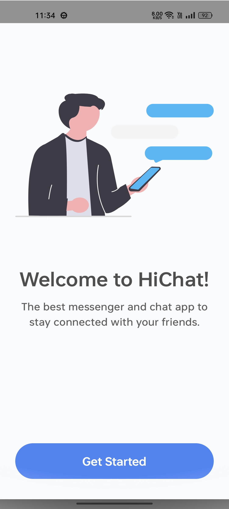
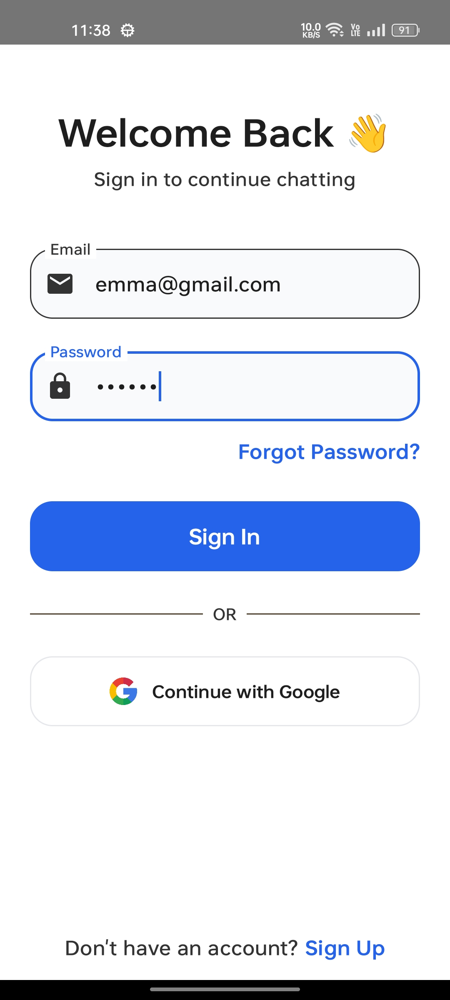
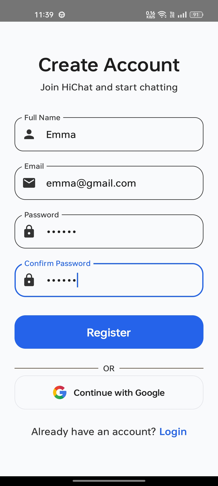
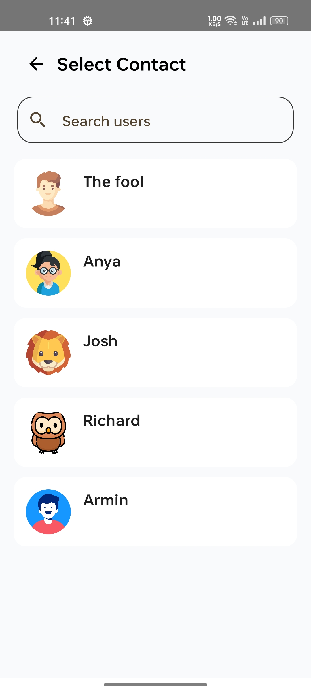
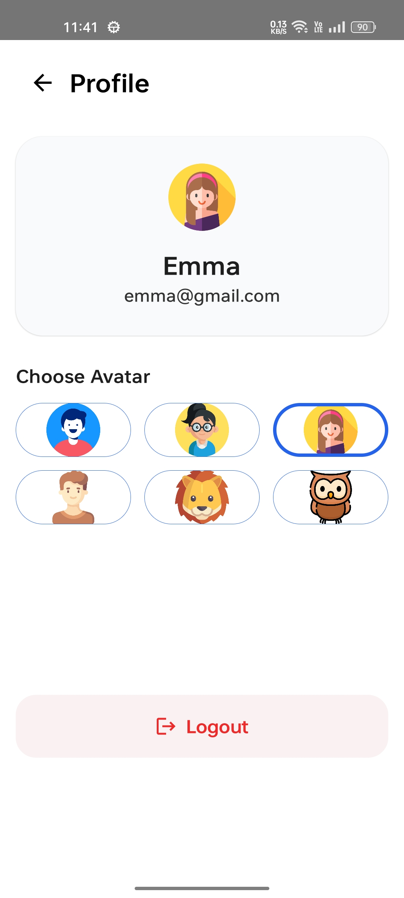

# 💬 HiChat

HiChat is a simple real-time chat application built with Kotlin and Jetpack Compose.

I built this project to learn how chat applications like WhatsApp work. During this project I learned Firebase Authentication, Cloud Firestore, MVVM Architecture, Navigation, and building modern Android UI with Jetpack Compose.

---

# 📱 Screenshots

| Splash |
|---------|
|  |

| Welcome | Login | Register |
|---------|--------|----------|
|  |  |  |

| Home | Chat | New Chat |
|------|------|----------|
|  |  |  |

| Profile |
|---------|
|  |

---

# ✨ Features

- User Registration
- User Login
- Google Sign-In UI
- Firebase Authentication
- Real-time Chat
- Last Message Preview
- Search Users
- New Chat Screen
- Avatar Selection
- Profile Screen
- Splash Screen
- Modern Material 3 UI
- MVVM Architecture

---

# 🛠 Tech Stack

- Kotlin
- Jetpack Compose
- MVVM Architecture
- Firebase Authentication
- Cloud Firestore
- Material 3
- Navigation Compose

---

# 📂 Project Structure

```
app
│
├── data
│   ├── firebase
│   ├── model
│   └── repository
│
├── ui
│   ├── components
│   ├── navigation
│   ├── screens
│   └── theme
│
└── viewmodel
```

---

# 📚 What I Learned

Building HiChat helped me understand:

- MVVM Architecture
- Firebase Authentication
- Cloud Firestore
- Real-time Messaging
- Repository Pattern
- State Management
- Navigation in Jetpack Compose
- Search Functionality
- Profile Management
- Reusable UI Components
- Clean Project Structure
- Modern Android UI Design

---

# 🚀 Future Improvements

- Google Sign-In
- Image Sharing
- Read Receipts
- Online & Offline Status
- Push Notifications
- Dark Mode
- Message Reactions
- Delete Messages
- Edit Profile

---

# ▶️ Getting Started

1. Clone this repository

```bash
git clone https://github.com/yourusername/HiChat.git
```

2. Open the project in Android Studio.

3. Connect Firebase.

4. Add your `google-services.json` file.

5. Sync Gradle.

6. Run the app.

---

# 💡 Why I Built This

I wanted to learn how messaging applications work by building one from scratch.

This project gave me hands-on experience with Firebase, Jetpack Compose, MVVM Architecture, real-time databases, and designing clean Android user interfaces.

---

# 👨‍💻 Author

**Anisha Bisht**

- GitHub: https://github.com/Anisha956
- LinkedIn: https://linkedin.com/in/anisha-bisht

---

⭐ If you like this project, feel free to star the repository.